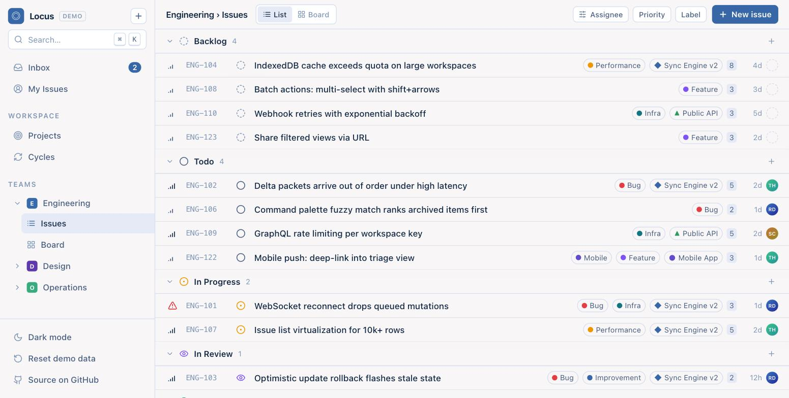
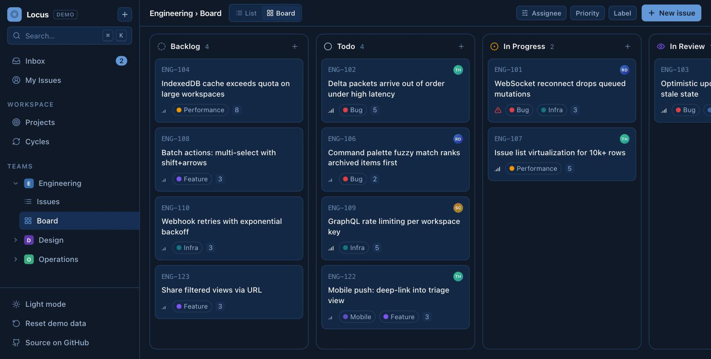

# ◎ Locus

**Issue tracking at the speed of thought.** A keyboard-first, local-first project tracker in the spirit of modern tools like Linear — built from scratch with Next.js 14, TypeScript, Tailwind CSS and Zustand.

**Live demo:** https://locus-navy.vercel.app *(no sign-up — seeded demo workspace, your changes persist locally)*






## Features

- **Issues** — grouped list by workflow status (Backlog → Todo → In Progress → In Review → Done → Canceled) with inline status & priority menus, labels, estimates, relative timestamps
- **Kanban board** — native HTML5 drag & drop between status columns
- **Issue panel** — editable title/description, status, priority, assignee, labels, project, cycle, estimate, comments
- **Command palette (⌘K)** — fuzzy search across every action, view and issue (built on `cmdk`)
- **Keyboard-first** — `C` new issue, `⌘K` palette, `B` board, `I` issues, `P` projects, `Esc` everywhere
- **Projects** — progress bars computed from issue state, health (On track / At risk / Off track), leads, target dates
- **Cycles** — time-boxed sprints with burn progress and point totals
- **Inbox** — notification center with unread state and jump-to-issue
- **Filters** — assignee / priority / label, composable
- **Light & dark themes** — a four-color ramp (`#F9F7F7 #DBE2EF #3F72AF #112D4E`) drives every surface via CSS variables
- **Local-first demo persistence** — the whole workspace lives client-side (Zustand + `localStorage`); instant optimistic updates, zero spinners — the same feel that makes sync-engine trackers special

## Stack

| Layer | Choice |
|---|---|
| Framework | Next.js 14 (App Router) + React 18 |
| Language | TypeScript (strict) |
| Styling | Tailwind CSS + CSS custom properties (theme tokens) |
| State | Zustand with `persist` middleware |
| Command menu | cmdk |
| Icons | lucide-react |

## Architecture notes

The app is deliberately **local-first**: the entire workspace (issues, projects, cycles, notifications) is an in-memory object graph persisted to `localStorage`, and every interaction is an optimistic local mutation — the pattern used by production sync-engine trackers, minus the server reconciliation layer. The store is a single typed Zustand slice (`lib/store.ts`); UI components subscribe to exactly the state they render, which keeps interactions at 60fps even with the full seeded workspace.

A real multi-user backend (Postgres + WebSocket delta sync) is the natural next step — the mutation API in the store is already shaped for it.

## Run locally

```bash
npm install
npm run dev     # http://localhost:3456
```

## Author

**Rimon Debnath** — Software Engineer (AI & Full-Stack)
Portfolio: https://rimon-portfolio.vercel.app · GitHub: [@Rimonok12](https://github.com/Rimonok12) · LinkedIn: [rimon12](https://linkedin.com/in/rimon12)
